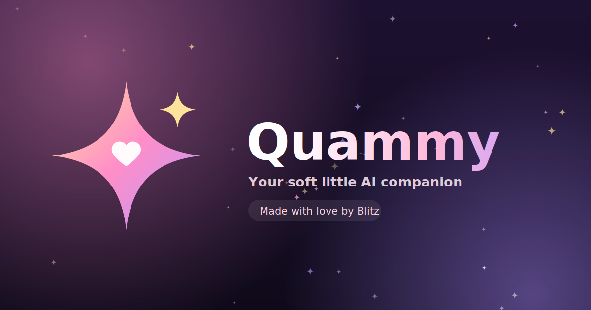

<div align="center">


# Quammy

**Your soft little AI companion.**

Sweet, honest and always glowing. She feels every word, sparkles when she's happy, and chats like a real friend.

[Live site](https://quammy.devs.surf) · [Chat with her](https://quammy.devs.surf/chat) · [Made by Blitz](https://blitz.devs.surf/?ref=quammy)



</div>

---

## Features

- **Mood dots.** A tiny glowing dot beside each reply shows how she feels: happy, over the moon, loved, shy, caring, sleepy or thinking.
- **Sparkles.** Very happy moments make stars pop out of her message and a shine sweep across the bubble.
- **Emoji replies.** She talks with emojis like a real girl, while the interface itself uses clean SVG icons.
- **Mood diary.** Mood bars, chat stats and a timeline built from your own conversations.
- **Themes.** Rose, Lilac, Peach, Mint and Midnight. The whole site and the floating particles change colors.
- **Voice input.** A mic button for speaking instead of typing, on browsers that support it.
- **Chat memory.** Your conversation is saved on your device and restored when you come back.
- **Installable.** Works as a home-screen app (PWA) with its own icon.
- **Cute particles.** Hearts, stars and dots drift in the background and move away from your finger.
- **Mobile first.** Built and tested for small phone screens.

## Routes

The site is a single-page app with clean URLs.

| Route | What it is |
| --- | --- |
| `/home` | Landing page with a live demo chat |
| `/features` | Everything Quammy does |
| `/moods` | Her seven moods, tap to hear her |
| `/chat` | The chat itself |
| `/diary` | Your mood history |
| `/themes` | Pick her colors |
| `/install` | Add her to your home screen |
| `/about` | Who she is and who made her |
| `/privacy` | How data is handled |
| `/help` | Quick answers |

## Project structure

```
.
├── index.html            App shell (head, nav, menu, footer)
├── 404.html              Copy of index.html, used as a fallback on some hosts
├── site.webmanifest      PWA manifest
├── vercel.json           Route rewrites for Vercel
├── _redirects            Route rewrites for Netlify and Cloudflare Pages
├── robots.txt
├── favicon.ico
├── apple-touch-icon.png
└── assets/
    ├── app.js            Router, all pages, themes, diary and chat logic
    ├── quammy.js         Particles, sparkle bursts and mood detection
    ├── base.css          Colors, background, buttons
    ├── site.css          Landing page and chat styles
    ├── pages.css         Menu, inner pages and mobile fixes
    ├── logo.svg
    ├── favicon.svg
    ├── icon-192.png
    ├── icon-512.png
    ├── og.png            Social preview image (1200x630)
    └── banner.png        Banner image (1500x500)
```

There is no build step and no dependencies. It is plain HTML, CSS and JavaScript.

## Run locally

Opening `index.html` directly will not work, because the routes need a server that falls back to `index.html`. Use any of these from the project folder:

```bash
npx serve -s .
```

Then open the address it prints, for example `http://localhost:3000/home`.

## Deploy

Upload the whole folder and keep the `assets` folder as it is.

| Host | What to do |
| --- | --- |
| **Vercel** | Import the repo. `vercel.json` handles the routes. |
| **Netlify / Cloudflare Pages** | Publish the folder. `_redirects` handles the routes. |
| **GitHub Pages** | Publish the folder. `404.html` handles the routes. |
| **Render (Static Site)** | Add a rewrite rule in the dashboard: `/*` to `/index.html`. |

The site is meant to live at the root of a domain (for example `quammy.devs.surf`), not in a sub-folder.

## Customize

- **Her personality.** Edit `SYSTEM_PROMPT` near the bottom of `assets/app.js`.
- **Her AI service.** The chat calls two endpoints on `prexzyapis.com` inside the `ask` function in `assets/app.js`. Swap those URLs to use a different service.
- **Colors.** Edit the `THEMES` object in `assets/app.js`.
- **Moods.** The mood list and the words that trigger each one are in `assets/quammy.js`.
- **Domain.** If you change the domain, search for `quammy.devs.surf` in `index.html` and `assets/app.js` and replace it.
- **Brand images.** `logo.svg`, `favicon.svg`, `og.png`, `banner.png` and the app icons are all in `assets/`.

## Privacy

- Chat history, the mood diary and your color choice are stored only in your browser (`localStorage`).
- To write her replies, your message and the last few messages are sent to the third-party AI service. Don't share passwords or other secrets in the chat.
- No sign-up, no ads.

## Credits

Made with love by [Blitz](https://blitz.devs.surf/?ref=quammy).
